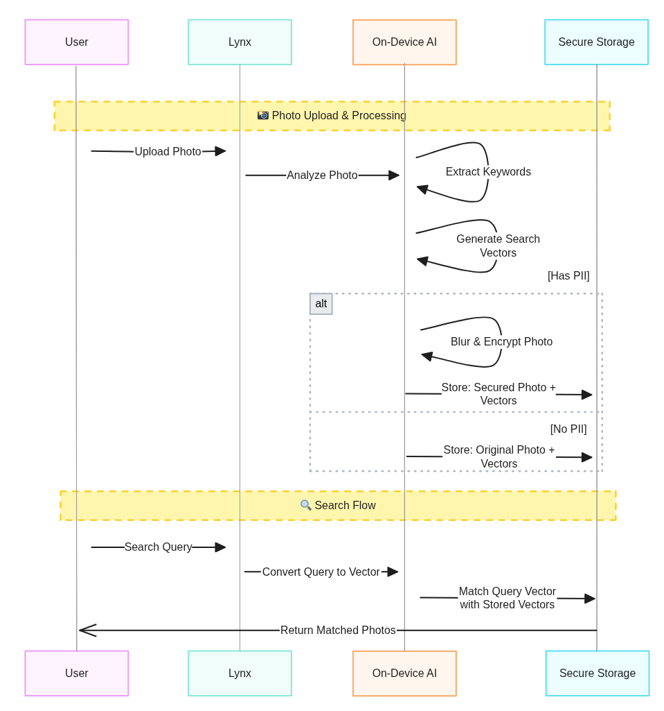
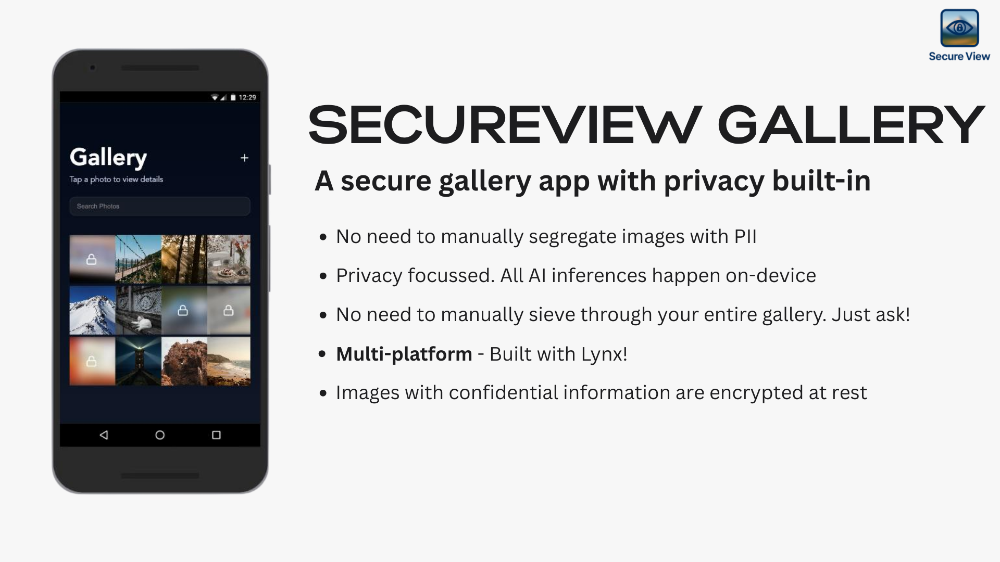
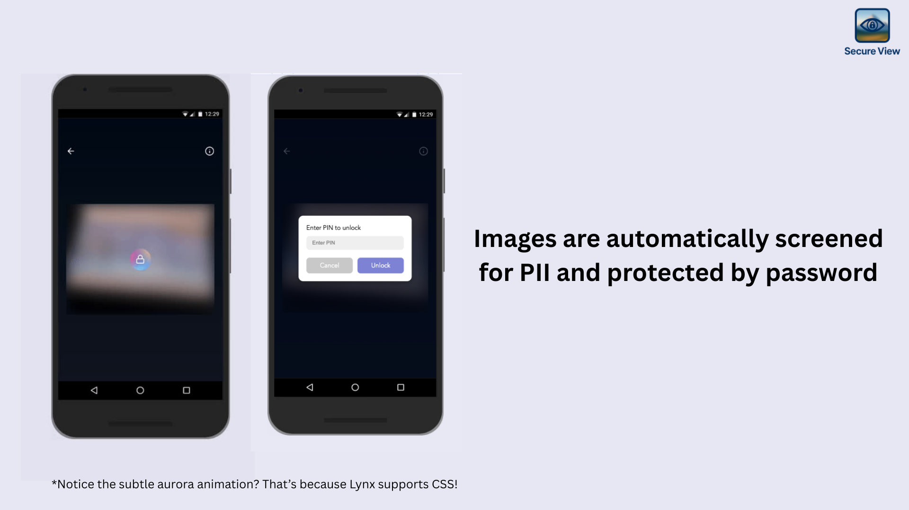
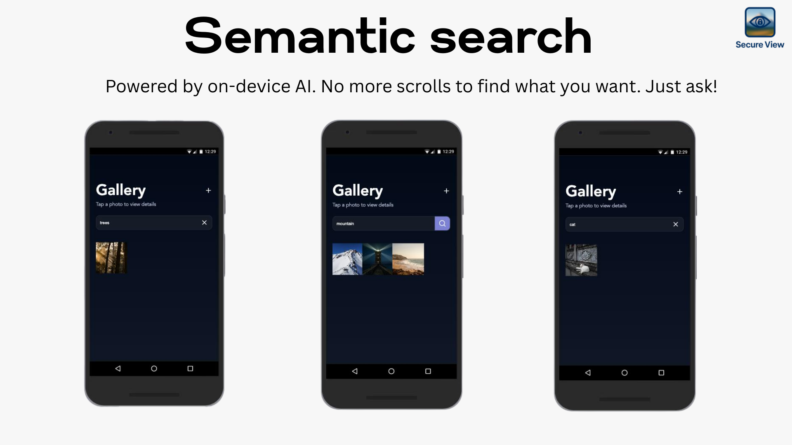

## SecureView Gallery

This is a pnpm workspace project, consisting of two packages:

- **lynx-project**: a ReactLynx project bootstrapped with `create-rspeedy`.
- **react-container**: a React project bootstrapped with `create-rsbuild`.


## Architecture


<p align="center">
	
</p>

## Features

Below are some screenshots and architecture diagram from the `resources/` directory:

<p align="center">
	
	
	
</p>

## Getting started

First, install the dependencies:

```bash
pnpm install
```


You can independently work on the Lynx app to leverage the rich ecosystem of tooling the framework has to offer just by launching and running the Lynx application
```bash
cd packages/lynx-project
pnpm run dev
```


## Running the project finally under the web host
Then, build the lynx-project:

```bash
pnpm run build
```

Finally, run the react-container:

```bash
pnpm run dev
```

Visit `http://localhost:3000/` with your browser to see the final application